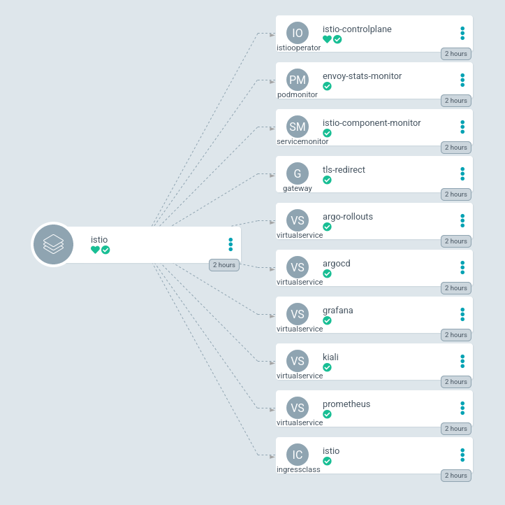

# 03 - Software installation

## Full install : summary

In this section, we will describe how to quickly install a full setup based on k3s/Prometheus/ArgoCD/Istio. The appropriate workflow is the following one :

1. k3d     ----install---->  k3s cluster
2. helm    ----install---->  Prom stack
3. helm    ----install---->  ArgoCD
4. argocd  ----install---->  NFS-client-provisioner
5. argocd  ----install---->  Istio-operator
6. argocd  ----install---->  Istio-server
7. argocd  ----install---->  Argo-Rollouts
8. argocd  ----install---->  Kiali-operator + server

## Full install step 1 : k3d install

:pushpin: Prerequisite:
- k3d binary last version (5.1.0 at the moment of writing)
- Customized rancher/k3s image (if you need NFS support)
- Dedicated directory to store k3s configuration
- HA proxy in front of k3s cluster

Create your cluster with a `Simple` yaml definition file :

```
k3d cluster create --config k3d-create.yaml
```

YAML file :
```yaml
apiVersion: k3d.io/v1alpha3
kind: Simple
name: fredcorp
servers: 2
agents: 0
image: k3s:v1.21.5-k3s2-alpine314
volumes:
- volume: /home/fred/k3s-config/:/var/lib/rancher/k3s/server/manifests/
  nodeFilters:
    - server:*
ports:
  - port: 5080:80
    nodeFilters:
      - loadbalancer
  - port: 5443:443
    nodeFilters:
      - loadbalancer
options:
  k3d:
    wait: true
    timeout: 2m0s
  k3s:
    extraArgs:
    - arg: --tls-san=192.168.0.150
      nodeFilters:
      - server:*
    - arg: --no-deploy=traefik
      nodeFilters:
      - server:*
  kubeconfig:
    updateDefaultKubeconfig: true
```

You should have your cluster running properly :
```console
[root@workstation ~]# k3d cluster list
NAME       SERVERS   AGENTS   LOADBALANCER
fredcorp   2/2       0/0      true

[root@workstation ~]# docker ps
CONTAINER ID   IMAGE                        COMMAND                  CREATED          STATUS          PORTS                                                                                                     NAMES
4f264b1b8884   rancher/k3d-proxy:5.1.0      "/bin/sh -c nginx-pr…"   47 minutes ago   Up 47 minutes   0.0.0.0:5080->80/tcp, :::5080->80/tcp, 0.0.0.0:5443->443/tcp, :::5443->443/tcp, 0.0.0.0:35797->6443/tcp   k3d-fredcorp-serverlb
e5b44cb448b7   k3s:v1.21.5-k3s2-alpine314   "/entrypoint server …"   47 minutes ago   Up 47 minutes                                                                                                             k3d-fredcorp-server-1
e78bdc231729   k3s:v1.21.5-k3s2-alpine314   "/entrypoint server …"   47 minutes ago   Up 47 minutes                                                                                                             k3d-fredcorp-server-0
```

Merge the kube config file, replace the IP `0.0.0.0` by your local k3s cluster VM IP address if needed and then copy to your remote machine into `~/.kube/config`.
```
k3d kubeconfig merge --all --kubeconfig-merge-default
sed -i 's/0.0.0.0/192.168.0.150/g' /root/.kube/config
```

:warning: **WARNING !!** :warning:

HA proxy should be running on your VM redirecting ports `5080` and `5433` :
```
frontend http-frontend
       bind *:80
       default_backend http-backend

backend http-backend
       balance roundrobin
   # 31953 is the "NodePort" of Ingress HTTP Service
       server k3s 192.168.0.150:5080 check

frontend https-frontend
       bind *:443
       default_backend https-backend
   #
backend https-backend
       balance roundrobin
   # 32755 is the "NodePort" of Ingress HTTPS Service
       server k3s 192.168.0.150:5443 check
```

## Full install step 2 : Prometheus stack install

Fetch `kube-prometheus-stack` helm chart and install it with customized `values.yaml`.

```
helm upgrade -i prom -n monitoring kube-prometheus-stack/ --create-namespace
```

you can use the provided `values.yaml` file [here](../resources/full-install/prom-stack/prom-values.yaml)
```console
[root@workstation ~]# kubectl get pods -n monitoring
NAME                                                     READY   STATUS    RESTARTS   AGE
alertmanager-prom-kube-prometheus-stack-alertmanager-0   2/2     Running   0          12m
prom-grafana-76cb6fc8f8-vrsw4                            2/2     Running   0          12m
prom-kube-prometheus-stack-operator-6f8bcdc4df-d4g2x     1/1     Running   0          12m
prom-kube-state-metrics-759457c944-kbv6m                 1/1     Running   0          12m
prometheus-prom-kube-prometheus-stack-prometheus-0       2/2     Running   0          12m
```

## Full install step 3 : ArgoCD install

Fetch `argo-cd` helm chart and install it.

```
helm repo add argo https://argoproj.github.io/argo-helm
helm fetch --untar argo/argo-cd
```

Custom install with `--insecure` flag to deny Passthrough TLS redirection (in order to delegate TLS encryption to the API gateway/Service Mesh), `ServiceMonitor` enabled and labeled to activate Prometheus scraping.
```
helm upgrade -i argocd -n argocd --create-namespace argo-cd/ --set controller.metrics.enabled=true \
                                                             --set controller.metrics.serviceMonitor.enabled=true \
                                                             --set controller.metrics.serviceMonitor.additionalLabels.release=prom \
                                                             --set dex.enabled=false \
                                                             --set server.metrics.enabled=true \
                                                             --set server.metrics.serviceMonitor.enabled=true \
                                                             --set server.metrics.serviceMonitor.additionalLabels.release=prom \
                                                             --set server.extraArgs={--insecure} \
                                                             --set repoServer.metrics.enabled=true \
                                                             --set repoServer.metrics.serviceMonitor.enabled=true \
                                                             --set repoServer.metrics.serviceMonitor.additionalLabels.release=prom
```

Then fetch and decode the admin password :
```
kubectl get secret -n argocd argocd-initial-admin-secret -o jsonpath='{.data.password}' | base64 --decode
```

You will need to temporarily access the ArgoCD Web GUI by executin port-forwarding (since we do not have Ingress controller yet):
```
kubectl port-forward pods/argocd-server-5dcfb599b5-r22bl -n argocd 8080:8080
```

And access The ArgoCD Web GUI on `http://localhost:8080` on your machine.

## Full install step 4 : NFS client provisioner install

Add the helm istio repository `https://kubernetes-sigs.github.io/nfs-subdir-external-provisioner/` to the list of ArgoCD repositories. Then create a new app from this repositoy.

Override following parameters :
- `nfs.server` to your NFS server IP address
- `nfs.path` to your NFS server shared path
- `storageClass.accessModes` to `ReadWriteMany`
- `storageClass.name` to `nfs-client-retain`

Final rendering :
```yaml
apiVersion: argoproj.io/v1alpha1
kind: Application
metadata:
  name: nfs-provisioner
spec:
  destination:
    name: ''
    namespace: nfs
    server: 'https://kubernetes.default.svc'
  source:
    path: ''
    repoURL: 'https://kubernetes-sigs.github.io/nfs-subdir-external-provisioner/'
    targetRevision: 4.0.14
    chart: nfs-subdir-external-provisioner
    helm:
      valueFiles:
        - values.yaml
      parameters:
        - name: nfs.server
          value: 192.168.0.151
        - name: nfs.path
          value: /NFS/data-k3s
        - name: storageClass.accessModes
          value: ReadWriteMany
  project: default
  syncPolicy:
    automated:
      prune: true
      selfHeal: true
    syncOptions:
      - CreateNamespace=true
      - ApplyOutOfSyncOnly=true
```

:pushpin: If you need to, you can also apply the `Retain` `StorageClass` available [here](../resources/full-install/nfs-provisioner/storageclass-retain.yaml).

Change the default `StorageClass` of the cluster:
```
kubectl patch storageclass nfs-client -p '{"metadata": {"annotations":{"storageclass.kubernetes.io/is-default-class":"true"}}}'
kubectl patch storageclass local-path -p '{"metadata": {"annotations":{"storageclass.kubernetes.io/is-default-class":"false"}}}'
```

## Full install step 5 : Istio-operator install

Creae the `istio-system` namespace before if needed and create a `Secret` containing your wildcard certificate and the associated private key that you plan to use as TLS encryption for your whole infrastructure. You can generate your certificate with any PKI (like Vault) or as a self signed wildcard certificate:

```
kubectl create secret tls fredcorp-wildcard-cert --key="certs/private.key" --cert="certs/cert.crt" -n istio-system
```

Add the helm istio repository `https://stevehipwell.github.io/helm-charts/` to the list of ArgoCD repositories. Then create a new app from this repositoy.

Override following parameters :
- `dashboards.enable` to `true`
- `serviceMonitor.enabled` to `true`

And then use the `VALUES` field to override inexistant parameters :
```yaml
serviceMonitor:
  additionalLabels:
    release: prom
```

Final rendering is as following :
```yaml
apiVersion: argoproj.io/v1alpha1
kind: Application
metadata:
  name: trst
spec:
  destination:
    name: ''
    namespace: istio-operator
    server: 'https://kubernetes.default.svc'
  source:
    path: ''
    repoURL: 'https://stevehipwell.github.io/helm-charts/'
    targetRevision: 2.4.0
    chart: istio-operator
    helm:
      parameters:
        - name: dashboards.enabled
          value: 'true'
        - name: serviceMonitor.enabled
          value: 'true'
      values: |-
        serviceMonitor:
          additionalLabels:
            release: prom
      valueFiles:
        - values.yaml
  project: default
  syncPolicy:
    automated:
      prune: true
      selfHeal: true
    syncOptions:
      - CreateNamespace=true
      - ApplyOutOfSyncOnly=true
```

Create the App and wait for its synchronization.

## Full install step 6 : Istio-server install

Fork the current Github reposity and add it to the list of ArgoCD repositories. Then create a new app from this repositoy with the path `resources/full-install/istio-server` in the `istio-system` namespace.

:warning: **WARNING !!** :warning:

Install will fail since the CR `Gateway` and `VirtualService` need first the `IstioOperator` to be installed. So delete both `Gateway` and `VirtualService` resources from the repo before creating the app and then add it again to the directory to synchronize it and create it after the `IstioOperator` has been deployed.

:pushpin: You will have :
- 1 `IstioOperator` control plane.
- 1 `Gateway` for TLS redirection.
- 1 `PodMonitor`
- 1 `ServiceMonitor`
- 1 `IngressClass`
- 5 `VirtualService` pointing to differents services.

<p align="center">
  
</p>

## Full install step 7 : Argo Rollouts install

Add the helm istio repository `https://argoproj.github.io/argo-helm` to the list of ArgoCD repositories. Then create a new app from this repositoy.

Override following parameters :
- `controller.metrics.enabled` to `true`
- `controller.metrics.serviceMonitor` to `true`
- `dashboards.enabled` to `true`

And then use the `VALUES` field to override inexistant parameters :
```yaml
controller:
  metrics:
    serviceMonitor:
      additionalLabels:
        release: prom
```

Final rendering:
```yaml
apiVersion: argoproj.io/v1alpha1
kind: Application
metadata:
  name: argo-rollouts
spec:
  destination:
    name: ''
    namespace: argocd
    server: 'https://kubernetes.default.svc'
  source:
    path: ''
    repoURL: 'https://argoproj.github.io/argo-helm'
    targetRevision: 2.5.0
    chart: argo-rollouts
    helm:
      valueFiles:
        - values.yaml
      parameters:
        - name: controller.metrics.enabled
          value: 'true'
        - name: controller.metrics.serviceMonitor.enabled
          value: 'true'
        - name: dashboard.enabled
          value: 'true'
      values: |-
        controller:
          metrics:
            serviceMonitor:
              additionalLabels:
                release: prom
  project: default
  syncPolicy:
    syncOptions:
      - CreateNamespace=true
      - ApplyOutOfSyncOnly=true
    automated:
      prune: true
      selfHeal: true
```

Create the App and wait for its synchronization.

## Full install step 8 : Kiali operator and server install

Add the helm istio repository `https://kiali.org/helm-charts` to the list of ArgoCD repositories. Then create a new app from this repositoy.

Override following parameters :
- `cr.create` to `true`
- `cr.namespace` to `istio-system`

And then use the `VALUES` field to override inexistant parameters :
```yaml
cr:
  spec:
    auth: 
      strategy: anonymous
    external_services:
      prometheus:
        url: 'http://prom-kube-prometheus-stack-prometheus.monitoring:9090/'
      grafana:
        enabled: true
        in_cluster_url: "http://prom-grafana.monitoring.svc.cluster.local:80"
        url: "https://grafana.fredcorp.com"
        auth:
          ca_file: ""
          insecure_skip_verify: true
          password: "admin"
          token: ""
          type: basic
          use_kiali_token: false
          username: "admin"
        dashboards:
        - name: "Istio Service Dashboard"
          variables:
            namespace: "var-namespace"
            service: "var-service"
        - name: "Istio Workload Dashboard"
          variables:
            namespace: "var-namespace"
            workload: "var-workload"
        - name: "Istio Mesh Dashboard"
        - name: "Istio Control Plane Dashboard"
        - name: "Istio Performance Dashboard"
        - name: "Istio Wasm Extension Dashboard"
```

Set the correct URL for `Prometheus` and `Grafana`.

Final rendering:
```yaml
apiVersion: argoproj.io/v1alpha1
kind: Application
metadata:
  name: kiali-operator
spec:
  destination:
    name: ''
    namespace: kiali-operator
    server: 'https://kubernetes.default.svc'
  source:
    path: ''
    repoURL: 'https://kiali.org/helm-charts'
    targetRevision: 1.43.0
    chart: kiali-operator
    helm:
      valueFiles:
        - values.yaml
      values: |-
        cr:
          spec:
            auth: 
              strategy: anonymous
            external_services:
              prometheus:
                url: 'http://prom-kube-prometheus-stack-prometheus.monitoring:9090/'
              grafana:
                enabled: true
                in_cluster_url: "http://prom-grafana.monitoring.svc.cluster.local:80"
                url: "https://grafana.fredcorp.com"
                auth:
                  ca_file: ""
                  insecure_skip_verify: true
                  password: "admin"
                  token: ""
                  type: basic
                  use_kiali_token: false
                  username: "admin"
                dashboards:
                - name: "Istio Service Dashboard"
                  variables:
                    namespace: "var-namespace"
                    service: "var-service"
                - name: "Istio Workload Dashboard"
                  variables:
                    namespace: "var-namespace"
                    workload: "var-workload"
                - name: "Istio Mesh Dashboard"
                - name: "Istio Control Plane Dashboard"
                - name: "Istio Performance Dashboard"
                - name: "Istio Wasm Extension Dashboard"
      parameters:
        - name: cr.create
          value: 'true'
        - name: cr.namespace
          value: istio-system
  project: default
  syncPolicy:
    automated:
      prune: true
      selfHeal: true
    syncOptions:
      - ApplyOutOfSyncOnly=true
      - CreateNamespace=true
```
